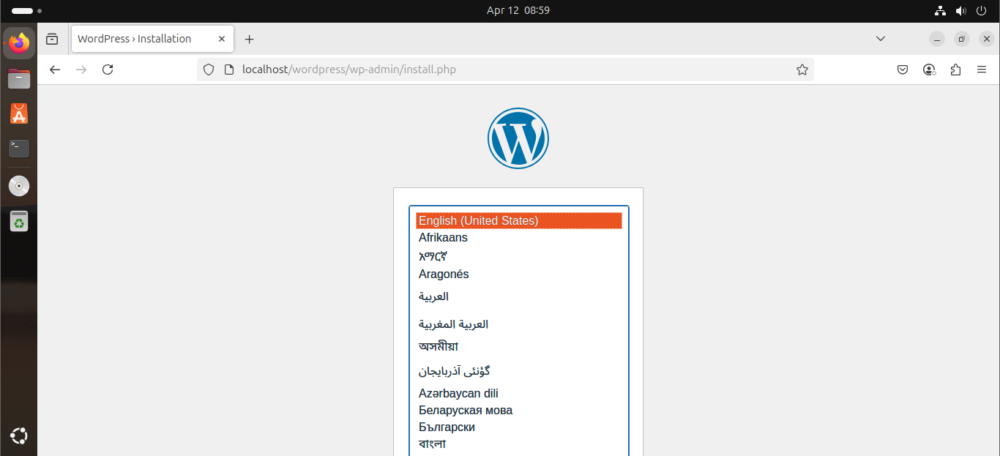

# WordPress Deployment with Ansible

This project automates the deployment of a WordPress application using Ansible and role-based architecture. It installs Apache, PHP, MySQL, and sets up WordPress on a target server.

---

## Project Structure

```
wordpress-ansible/
├── site.yml                 # Main playbook
├── .gitignore
├── inventory                # Inventory file with target hosts
└── roles/                   # Ansible roles
    ├── apache/
         ├── main.yaml          # Apache installation and configuration
    ├── php/                   # PHP and required extensions
         ├── main.yaml                
    ├── mysql/                 # MySQL server and DB/user setup
         ├── main.yaml              
    └── wordpress/                # WordPress installation and setup
        ├── tasks/
        │   └── main.yml
        ├── templates/
           └── wp-config.php.j2
          
```

---

## Prerequisites

- A remote Linux server (tested on Ubuntu)
- Ansible installed on your local machine
- SSH access to the remote server
- Python 3 on the target machine
---

## Usage

### 1. Update the Inventory File

Create `inventory` file with your server's IP or hostname:

```ini
[webservers]
ansible_host=HOST_IP ansible_user=USERNAME ansible_become_password=BECOME_USER_PASSWORD ansible_ssh_private_key_file=PRIVATE_KEY_PATH
```

---

### 2. Run the Playbook

```bash
ansible-playbook -i inventory site.yml
```

---

## Default Database Settings

These are the default settings hardcoded in the playbook:

- **Database Name:** `wordpress`
- **DB User:** `wp_user`
- **DB Password:** `wp_pass`
- **Table Prefix:** `wp_`

---

## Notes

- Apache will serve WordPress from `/var/www/html/wordpress`.
- File ownership is set to `www-data` for proper web access.
- MySQL user and database are created automatically.

## Application is Up
